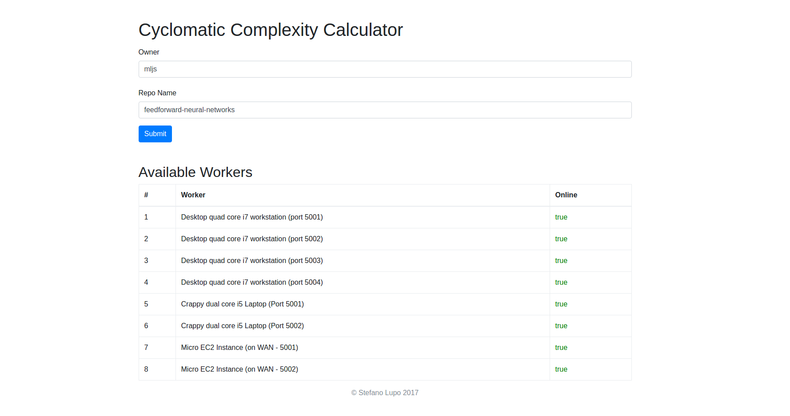
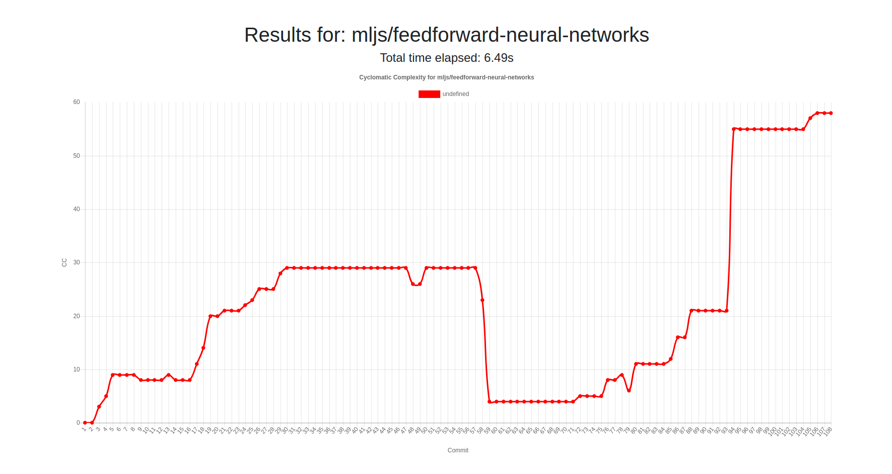
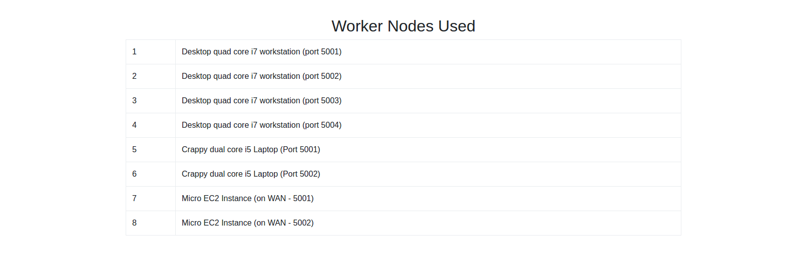
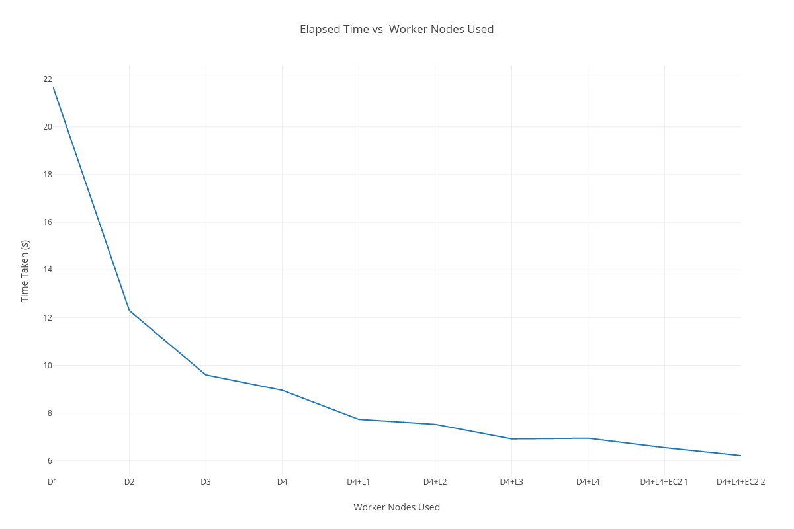

# Distributed Cyclomatic Complexity Calculator
This repository contains code for the master server of a distributed cyclomatic complexity calculator. The code for the worker nodes is contained in the [Cyclomatic-Complexity-Worker](https://github.com/stefano-lupo/Cyclomatic-Complexity-Worker) repo.

Stick in live link

## Implementation
The master server contains a simple REST API built in Node.js + Express. Once given a Github repository, the master server communicates with the Github API in order to fetch all of the required information to build a `Repository` object. This looks something like the following:
1. Fetch all commits in the repo.
2. Fetch meta data for each file in each commit in parallel.
3. Build `Repository` object once all files meta-data has been fetched.

### The Repository Class
The Repository class contains all of the data structures and implementations required for processing a repository. The Repository class contains two key data structures:

1. `workQueue`
    - This is a queue of jobs for workers to do - there is a job for each file in each commit.
    - As workers request work, the server simply dequeues the next job and sends it to the worker.
    - Each job contains:
      - `repoHash` - unique identifier for the repository
      - `commitSha` - unique identifier for a commit in the repository
      - `file` - the path of the file relative to the commit's root

2. `commitsMap`
    - This is a Map from a `commitSha` -> `commit` object
    - Each `commit` object contains:
      - `numFilesCompleted` - number of files that have been processed (CC calculated) in this commit
      - `cc` - the average cyclomatic complexity of the files in this commit
      - `filesToCCMap` - a Map from a filePath -> cyclomatic complexity for that file

   
   
The other key component of the Repository class is the `saveResult(commitSha, filename, cc)` method. This is called when a worker posts back results of a computation to the server and it does the following:
  - Extracts the `commit` object from the `commitsMap` using the `commitSha` contained in the POST request from the worker.
  - Sets the cyclomatic complexity `cc` in the `filesToCC` map of that commit using the `filename` contained in the POST request from the worker.
  - Checks to see if we have now processed all files for the given commit by comparing it's `numFilesCompleted` to the number of elements in it's `filesToCCMap` and computes the average if so.
    - Checks to see if we have now computed averages of all commits in the repo by comparing the `numCommitsCompleted` instance variable with the number of elements in the `commitsMap` and returns `true` if so.
    - The server can then check this functions return value and once it's true, can send on the results to the client. 

## Getting Workers to Clone Entire Repositories
- Once the server is in a stable state for a given repository, it makes a POST request to all the worker nodes, informing them to clone the specified repository.
  - This is done asynchronously allowing the workers to begin the processing as soon as they are ready.
- This method results in extra temporary bloat on each of the worker nodes as they are cloning an entire repository even though they may only need certain files of certain commits.
- However this seemed favourable in comparison to the workers having to make seperate HTTP requests to the Github API for every file that they need to process.
- Thus the workers need only make one *external* network request for every repo they must process.
- The pros / cons of this choice would depend largely on the size of the repository and the number of worker nodes. 
  - As I did not have access to a huge number of worker nodes, each worker node would end up doing a lot of the processing of a given repo and thus is likely to require a signifcant proportion of the files contained in the repository.
   - However if I was using a larger number of nodes, it would possibly be better to only fetch the files a worker would need on the fly as they would each be processing a smaller number of files.
- Once the worker has successfully cloned the repository, it can begin requesting work from the master.

## Useage
The server provides a simple web interface in which a client can enter the owner and name of a repository they would like to examine and see the currently online worker nodes. 

Once the processing has completed, the client is shown a graph of the average cyclomatic complexity of each commit as well as the time ellapsed for the job.

It also shows which workers who took part in the processing.

## Results
The repository used for testing was [mljs/feedforward-neural-networks](https://github.com/mljs/feedforward-neural-networks). This is a relatively small repository containing 108 commits and 1.6Mb of files. 
It is worth noting that the cyclomatic complexity library that was used ([escomplex](https://github.com/escomplex/escomplex)) can only parse javascript files and thus these are the only files examined.

It is also worth noting that the workers I had access to were of drastically different computing power. 
The workers used were the following:

| Worker    | CPU                         | Notes                                                    |
|---------- |-----------------------------|--------------------------------------------------------- |
| Desktop   | Core i7 (quad core)         | Relatively powerful, was also running the master server.
| Latop     | Core i5 (dual core)         | Moderately powerful
| EC2 Micro | 1 vCPU, 1 vCore             | Low power

*Unfortunately, I could not get NPM to cooperate with the TCD Proxy and thus couldn't make use of SCSS OpenNebula*

The repository was processed repeatedly with an increasing amount of nodes. 
- I started with a single instance of a worker running on my desktop machine **(D)**, then added a second instance and a third and a fourth. This was to make use of the four cores on the CPU. 
- I then sequentially added four more workers running on my laptop **(L)**.
- Finally two more worker instances were added sequentially, on the EC2 Micro instance **(E)**.

This produced the following results:

| # Workers | Worker Machines | Elapsed Time (s) |
|---------- |-----------------|----------------- |
| 1         | 1D              | 21.684
| 2         | 2D              | 12.293
| 3         | 3D              | 9.622
| 4         | 4D              | 8.955
| 5         | 4D + 1L         | 7.736
| 6         | 4D + 2L         | 7.527
| 7         | 4D + 3L         | 6.918
| 8         | 4D + 4L         | 6.947s
| 9         | 4D + 4L + 1E    | 6.552s
| 10        | 4D + 4L + 2E    | 6.217s

This produced the following graph:

Thus the graph shows that as we increase the number of nodes, the time taken to process the repository decreases. This is due to the fact that there is essentially no overlap between each file to be processed meaning it is *embarrassingly parallel*. Thus my increasing the number of worker nodes, more files are processed in parallel, reducing the over all time taken. 

The graph does seem to level out quite quickly though however. This is mainly due to the size of the repository and the fact that the repository must be *cloned* by the workers.

The indicated elapsed time is the time difference between when the server notifies all of the worker nodes to clone the repository and when the server finally gets the last result (work queue empties for the given repository). Thus the overhead associated with cloning the repository plays a part in the elapsed time. The cloning operation is likely a substantial bottleneck as it requires extneral network requests and files to be downloaded.

For a large repository (that requires a substantial amount of time for processing), the impact of the cloning phase on the overall elapsed time would be dimished as **the workers spend a greater preportion of their time processing the data** which benefits from parallelization. Thus for a larger repository we expect to see a steeper (and continuing) decrease in the graph as the overall job spends more time in a phase that **benefits** from parallelization.   

- 11 Workers (5 Desktop + 4 Laptop + 2 EC2 (Same machine)): 6.41s || 6.912s
- 12 Workers (6 Desktop + 4 Laptop + 2 EC2 (Same machine)): 6.35s
- 13 Workers (7 Desktop + 4 Laptop + 2 EC2 (Same machine)): 6.82s
- 14 Workers (8 Desktop + 4 Laptop + 2 EC2 (Same machine)): 6.723s

Best Id guess: 
- 4 Desktop + 2 Laptop + 2 Ec2: 5.893s || 5.926
- 4 Desktop + 2 Laptop + 1 Ec2: 6.188s || 6.095s || 6.434s

Weird, T2 Micro gives 1 vCPU with 1 vCore

on targos/node-ftp
| # Workers | Worker Machines | Elapsed Time (s) |
|---------- |-----------------|----------------- |
| 1         | 1D              | 91.329
| 2         | 2D              | 53.437
| 3         | 3D              | 36.932
| 4         | 4D              | 31.000
| 5         | 4D + 1L         | 23.042
| 6         | 4D + 2L         | 20.931
| 7         | 4D + 3L         | 19.628
| 8         | 4D + 4L         | 18.354
| 9         | 4D + 4L + 1E    | 12.786
| 10        | 4D + 4L + 2E    | 11.579

